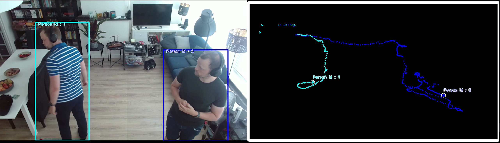

# Finding similarity between embedded representations of people

These classes can be used to track people or objects in a video without having to save the camera data, maintaining privacy. It does this by running object detection (using a YOLO network), then using the embedding layer of the famous CLIP model to change the image into an input tensor of size (1x512). These input tensors can then be compared to eachother in following frames. This allows us to ID a person or object as being
the same person over time, without having to store their likeness.

Note that this is very much a proof of concept and many improvements can be made, use at your own risk.

[A video of the results can be found here](https://www.linkedin.com/posts/martijn-folmer-68026287_computervision-machinelearning-yolo-activity-7079351112297783296-bQqT?utm_source=share&utm_medium=member_desktop) 
